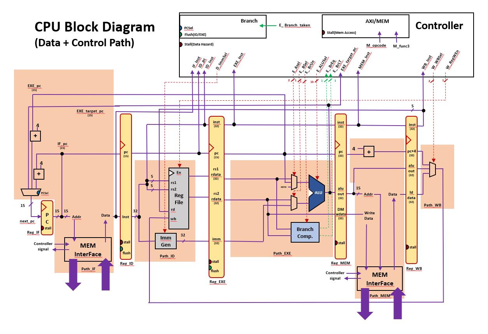
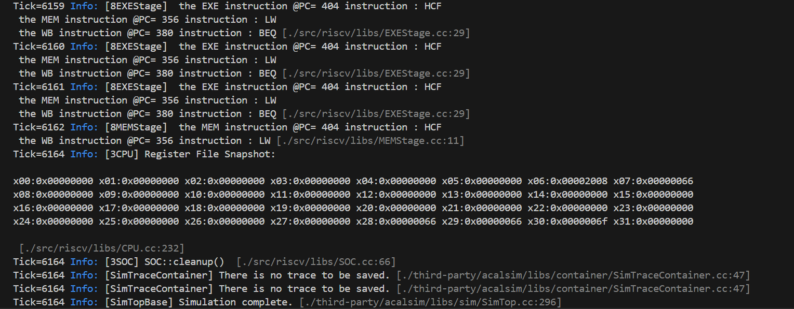
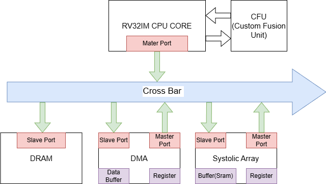
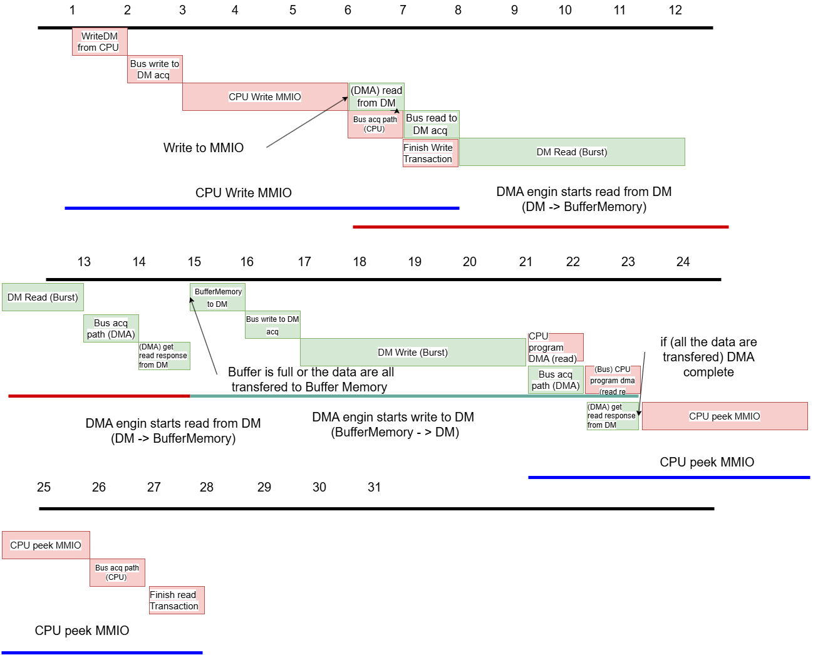
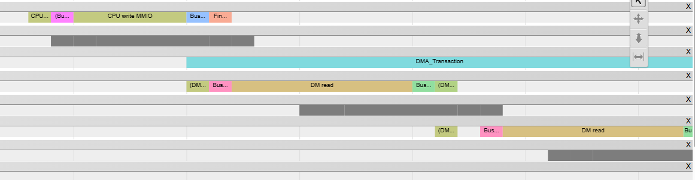
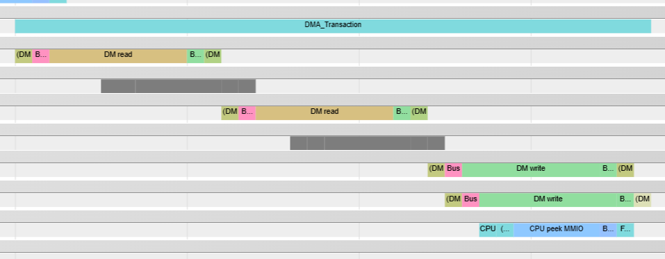
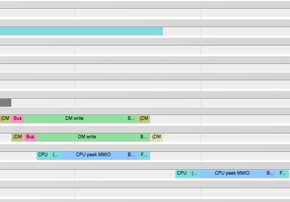

# SOC SW HW modeling

## Init & Working environment
You can refer the working environment [here](https://github.com/twhpcedu/acal-acalsim-workspace)

To initialized the project, you can call 
```
git submodule add git@github.com:twhpcedu/acalsim.git third-party/acalsim
git submodule update --init --recursive
pre-commit install
```

There are two modeling systems.  

## Target System (5-stage pipeline CPU)

The first one models the **5-stage RISC-V CPU**, originally implemented in Scala under the [Chisel implementation](./chisel_impl/src/main/scala/acal_lab09/).

This system includes **hazard detection** and **stall mechanisms**, as illustrated below:  


### Pipeline Structure

| Stage   | Module     | Function                                                         |
| :------ | :---------- | :--------------------------------------------------------------- |
| **IF**  | `IFStage`  | Fetch instruction from memory; handles flush and branch control. |
| **ID**  | `IDStage`  | Decode opcode and operands; performs hazard detection.           |
| **EXE** | `EXEStage` | Execute ALU and branch operations.                               |
| **MEM** | `MEMStage` | Perform load/store via packetized memory interface.              |
| **WB**  | Integrated | Write results back to register file.                             |

Each stage is implemented as an **independent simulator** and can be executed in **multithreaded mode**.

### Core Components

| Component                  | Description                                                                          |
| --------------------------- | ------------------------------------------------------------------------------------ |
| **Top**                    | Top-level module wrapper module that contains the connections for every simulators.   |
| **CPU**                    | Top-level module that sends the instruction to IF stage and put that in queue if not able to handle the request(hazard).   |
| **Emulator**               | Assembler/parser that translates RISC-V assembly into executable instruction memory. |
| **InstPacket / MemPacket** | Packet types used for inter-stage and memory communication.                          |
| **DataMemory**             | Simulated main memory, built on `BaseMemory`, supporting asynchronous read/write events. |

### EXECUTION result
```bash=
make debug TARGET=riscv
./build/debug/bin/riscv --asm_file_path src/riscv/asm/full_test.txt
```




## SOC modeling

```bash=
# Build command
BUILD_DIR="build/debug" && cmake -B "${BUILD_DIR}" -DCMAKE_BUILD_TYPE=Debug -DMT_DEBUG=OFF &&  cmake --build "${BUILD_DIR}" -j $(nproc) --target soc
# Run command
./build/debug/bin/soc --asm_file_path ./soc/asm/program_systolic_array.s
```

In the soc modeling, our target system is with the following structure.


The corresponding files are available at [Folder](./soc/).


## CPU

The CPU in this SoC is a **single-cycle core** (non-pipelined). Each instruction is fetched, executed, and committed within one simulation tick.

### Responsibilities

* Executes standard RISC-V integer, branch, and load/store instructions.
* Sends **non-burst memory requests** (read/write) through the CrossBar.
* Handles **CFU (Custom Function Unit)** offload and response.
* Manages instruction commit, PC update, and memory dump after execution.

### Timing Model

* One instruction per tick.
* Memory and CFU operations are asynchronous: commit occurs when their responses return.
* The next instruction event is scheduled immediately after commit (unless halted).

### Interfaces

* **Bus ports:**

  * `bus-m`: master port for issuing memory requests.
  * `bus-s`: slave port for receiving responses.
* **Retry path:** if the bus is busy, the request is queued and retried later.

### Internal Structure

* **Register File:** 32 × 32-bit (`rf[0..31]`).
* **Instruction Memory:** initialized at startup with host-loaded code.
* **Fetch → Execute → Commit:** no pipeline or hazard detection.

### Memory Access

* **Read:** constructs non-burst packet → sends via CrossBar → commits on response.
* **Write:** sends packet → commits when accepted.
* **MMIO:** device registers (e.g., DMA) are accessed as normal memory via bus transactions.

### CFU Offload

* Sends computation request through CFU port.
* Commits after receiving response with result written to destination register.

### Lifecycle

1. **Init:** binds ports, allocates memories, schedules first event.
2. **Execute:** one instruction per tick.
3. **Cleanup:** dumps registers and memory range `[0x2000, 0xEFFF]` for verification.

## DMA Controller & Burst Mode support

The DMA controller enables **direct memory transfers** between source and destination addresses without CPU intervention.
It is controlled via **MMIO registers** mapped at a predefined base address.

### Responsibilities

* Handles CPU MMIO reads/writes to configure and trigger DMA.
* Performs memory-to-memory data movement in bursts using the CrossBar interface.
* Supports partial-word transfers (SB, SH) for non-4-byte-aligned widths.
* Sets the `DONE` flag when the entire transfer completes.

### MMIO Registers

| Name             | Offset | Description                                                                                          |
| ---------------- | ------ | ---------------------------------------------------------------------------------------------------- |
| **ENABLE**       | `0x0`  | Bit[0]=1 starts DMA; auto-cleared on completion.                                                     |
| **SOURCE_INFO**  | `0x4`  | Source base address.                                                                                 |
| **DEST_INFO**    | `0x8`  | Destination base address.                                                                            |
| **DMA_SIZE_CFG** | `0xC`  | `[31:24] src_stride`, `[23:16] dst_stride`, `[15:8] TW`, `[7:0] TH`. Total transfer = (TW+1)×(TH+1). |
| **DONE**         | `0x14` | Bit[0]=1 when DMA is done; cleared by CPU.                                                           |

### Timing and Behavior

1. **Programming phase:**
   The CPU writes MMIO registers, then sets `ENABLE=1`.
2. **Initialization:**
   `initialized_transaction()` decodes `DMA_SIZE_CFG` and schedules the first read.
3. **Transfer cycle:**

   * **Read Phase:** `scheduleReadsForBuffer()` issues bursts of up to 4 words into an internal 256-word buffer.
   * **Write Phase:** `scheduleWritesFromBuffer()` drains the buffer to the destination, respecting stride and partial width.
   * Alternates between read/write until all data is transferred.
4. **Completion:**
   When finished, `transaction_complete()` sets `DONE=1` and clears `ENABLE`.


The state transition for DMA looks like 

### Parameters

| Parameter           | Meaning                                              |
| ------------------- | ---------------------------------------------------- |
| `max_burst_len`     | Determines burst size: `2 → 4 words per burst`.      |
| `bufferMemory[256]` | Temporary storage for a single read–write iteration. |

### State Machine

```text
IDLE → READING → WRITING → IDLE (done)
```

Each phase is event-scheduled in the simulation to model realistic latency and burst timing.


Demonstrate through visualization that your simulator’s timing model aligns with the expected behavior described in the previous point.

CPU program DMA

DMA transaction (Use the provided test for example)

CPU peek DMA



You can use the provided assembly to enable the dma for write.
```asm=
.data
src_data: .word 0x01, 0x02, 0x03, 0x04, 0x11, 0x12, 0x13, 0x14
          .word 0x05, 0x06, 0x07, 0x08, 0x15, 0x16, 0x17, 0x18

dest_data: .word 0x00, 0x00, 0x00, 0x00, 0x00, 0x00
           .word 0x00, 0x00, 0x00, 0x00, 0x00, 0x00

.text
start:
    li  x1, 0x0000f000 
    # DMA_MMIO_BASE_ADDR
    
    la  x2, src_data   
    # SOURCE_INFO
    la  x3, dest_data  
    # DEST_INFO
    li  x4, 0x20180f01 
    # DMA_SIZE_CFG
    
    li  x5, 1

    # Program DMA
    sw  x2, 4(x1)
    sw  x3, 8(x1)
    sw  x4, 12(x1)
    sb  x5, 0(x1)

check_complete:
    # Check whether the DMA command completes
    lw  x6, 20(x1)
    and x6, x6, x5
    beq x6, x0, check_complete
    sw  x0, 20(x1)

read_results:
    lw  x16, 0(x3)
    lw  x17, 4(x3)
    lw  x18, 8(x3)
    lw  x19, 12(x3)
    lw  x20, 16(x3)
    lw  x21, 20(x3)
    
    lw  x24, 24(x3)
    lw  x25, 28(x3)
    lw  x26, 32(x3)
    lw  x27, 36(x3)
    lw  x28, 40(x3)
    lw  x29, 44(x3)

exit:
    hcf
```

## CFU (Custom Function Unit)
We integrate the CFU in the way [this link](https://github.com/google/CFU-Playground) described.

The **CFU** extends the CPU with SIMD-like arithmetic operations for accelerated computation.
It supports element-wise addition, subtraction, and multiplication across packed 8-bit or 16-bit data.

### Responsibilities

* Decodes instruction type (Add/Sub or Mul) and dispatches to the corresponding computation unit.
* Performs parallel signed arithmetic across multiple sub-words within 32-bit operands.
* Returns results asynchronously to the CPU via the CFU response channel.

### Internal Structure

| Component                | Description                                                                                                               |
| ------------------------ | ------------------------------------------------------------------------------------------------------------------------- |
| **Controller**           | Determines which unit (Add/Sub or Mul) should handle the operation.                                                       |
| **AddSubActivationUnit** | Executes 8-bit or 16-bit addition/subtraction (e.g., `S_ADDI8I8S.vv`, `S_SUBI16I16S.vv`).                                 |
| **MulUnit**              | Performs signed 8-bit × 8-bit or 8-bit × 16-bit multiplications (e.g., `S_PMULI8I16S.vv.{L,H}`, `S_AMULI8I8S.vv.{L,NQ}`). |

### Data Flow

1. **CPU Request:**
   The CPU sends a `CFUReqPacket` containing the instruction and operands (`rs1`, `rs2`).
2. **Controller Dispatch:**
   The controller forwards operands to both units and selects the output type.
3. **Execution:**

   * *Add/Sub Unit:* parallel byte or halfword addition/subtraction.
   * *Mul Unit:* performs parallel signed multiplications, outputs either lower (`L`), higher (`H`), or narrowed (`NQ`) results.
4. **Response:**
   CFU generates a `CFURespPacket` with the computed result and sends it back to the CPU.

### Supported Instructions

| Category     | Instructions                                                           |
| ------------ | ---------------------------------------------------------------------- |
| **Add/Sub**  | `S_ADDI8I8S.vv`, `S_ADDI16I16S.vv`, `S_SUBI8I8S.vv`, `S_SUBI16I16S.vv` |
| **Multiply** | `S_PMULI8I16S.vv.{L,H}`, `S_AMULI8I8S.vv.{L,NQ}`                       |

### Operation Example

* `S_ADDI8I8S.vv`: adds four 8-bit signed integers packed in `rs1` and `rs2`.
* `S_PMULI8I16S.vv.L`: multiplies two lower 8-bit pairs and returns two 16-bit products.
* `S_AMULI8I8S.vv.NQ`: multiplies and returns the high 8 bits of each product (narrowed).

### Timing Model

The CFU operates in one functional step:

```text
CPU issues request → CFU computes → Response sent next cycle
```

This design models a 1-cycle latency computation unit.

### Assembly
You can run the following assembly for simple testbench or for more complex assembly that integrate the matrix multiplication & DMA in [matmul.s](./soc/asm/matmul_simd.s)

```asm=
.text
# ==== saddi8i8s.vv ====
li x10, 0x01020304       
# rs1 = [01, 02, 03, 04]
li x11, 0x05060708      
# rs2 = [05, 06, 07, 08]
saddi8i8s.vv x12, x10, x11
# Expected: [06, 08, 0a, 0c]

# ==== saddi16i16s.vv ====
li x13, 0x12345678       
# rs1 = [1234, 5678]
li x14, 0x11111111       
# rs2 = [1111, 1111]
saddi16i16s.vv x15, x13, x14
# Expected: [2345, 6789]

# ==== ssubi8i8s.vv ====
li x16, 0x05060708       
# rs1 = [05, 06, 07, 08]
li x17, 0x01020304       
# rs2 = [01, 02, 03, 04]
ssubi8i8s.vv x18, x16, x17
# Expected: [04, 04, 04, 04]

# ==== ssubi16i16s.vv ====
li x19, 0x56781234       
# rs1 = [5678, 1234]
li x20, 0x11111111       
# rs2 = [1111, 1111]
ssubi16i16s.vv x21, x19, x20
# Expected: [4567, 0123]

# ==== spmuli8i16s.vv.l ====
li x22, 0x01020304       
# rs1 = [01, 02, 03, 04]
li x23, 0x02020202       
# rs2 = [02, 02, 02, 02]
spmuli8i16s.vv.l x24, x22, x23
# Expected low 2 results as 16-bit values: 
# [0006, 0008] → x24

# ==== spmuli8i16s.vv.h ====
spmuli8i16s.vv.h x25, x22, x23
# Expected upper 2 results: [0002, 0004] → x25

# ==== samuli8i8s.vv.nq ====
li x26, 0x0F0E0D0C       
# rs1 = [0F, 0E, 0D, 0C]
li x27, 0x01020304       
# rs2 = [01, 02, 03, 04]
samuli8i8s.vv.nq x28, x26, x27
# Multiply → take MSB byte of each product → x28
# [00,00,00,00] x25
# ==== samuli8i8s.vv.l ====
samuli8i8s.vv.l x29, x26, x27
# Multiply → take LSB byte of each product → x29
# [0f 1c 27 30]
hcf
```


## Systolic Array

The **Systolic Array (SA)** is a hardware-accelerated computation unit used to perform **matrix multiplication**.
It integrates its own **on-chip SRAM**, **MMIO interface**, and **DMA coordination** to efficiently load matrices and compute results. In the PE design, we use `weight stationary` implement.

### Responsibilities

* Executes tiled matrix multiplication (`C = A × B`) using a 2×2 processing-element (PE) array.
* Manages memory access via **SRAM read/write handlers** through the CrossBar.
* Controls DMA transfers to fetch matrices A and B from main memory.
* Provides MMIO registers for CPU configuration and status polling.

### MMIO Registers

|           Offset | Name                | Description                                     |
| ---------------: | ------------------- | ----------------------------------------------- |
|              0x0 | **ENABLE**          | Starts computation when set to 1.               |
|              0x4 | **STATUS**          | Bit[0]=1 when computation is complete.          |
| 0x8 / 0xC / 0x10 | **MAT{A,B,C}_SIZE** | Encodes M, K, N dimensions.                     |
|        0x14–0x1C | **A/B/C_ADDR**      | Base addresses in SRAM.                         |
|             0x20 | **STRIDE**          | Strides for matrices A, B, C.                   |
|        0x24–0x2C | **A/B/C_ADDR_DM**   | Base addresses in **DataMemory** for DMA input. |

### Execution Flow

1. **Configuration:**
   CPU programs MMIO registers with matrix dimensions, addresses, and strides.
2. **DMA Load:**

   * SA requests DMA to copy matrices A and B from DataMemory into its SRAM.
   * `AskDMAtoWrite_matA()` and `AskDMAtoWrite_matB()` issue MMIO writes to the DMA controller.
3. **Matrix Fetch:**
   On DMA completion, data are unpacked into `A_matrix` and `B_matrix`.
4. **Computation:**

   * The array performs tiled matrix multiplication (`ComputeMatrix` → `ComputeTile`).
   * Each tile uses `LoadATile` and `LoadBTile` to feed submatrices to the PEs.
   * PEs perform multiply-accumulate (MAC) over several simulation cycles.
5. **Result Write-back:**
   When all tiles complete, `C_matrix` is printed or written back via DMA.
   The `done` flag is set for CPU polling.

### Architecture Overview

| Component          | Function                                                         |
| ------------------ | ---------------------------------------------------------------- |
| **SRAM**           | Local 32 KB memory for A/B/C storage (`sram_[]`).                |
| **PE Grid**        | 2×2 array of multiply–accumulate units with pipelined registers. |
| **MMIO Interface** | For control and configuration by the CPU.                        |
| **DMA Interface**  | Coordinates data movement from DataMemory into SRAM.             |

### Timing Model

The Systolic Array operates event-driven:

```
ENABLE=1 → DMA transfer (A,B) → Compute tiles → DONE=1
```

Each PE processes data in synchronized cycles with preloading, propagation, and flush phases scheduled by events.

### Verification via Trace

Chrome traces will show:

* CPU MMIO programming,
* DMA bursts for A/B transfers,
* SA tile computation events,
* Completion flag signaling back to the CPU.

### Parameters

| Parameter           | Meaning                                              |
| ------------------- | ---------------------------------------------------- |
| `SA_SRAM_SIZE`     | The sram size for systolic array |
| `SASIZE` | The based component size of systolic array |

### assembly

Basic implementation for a matmul in systolic array.

```asm=
.data
## allocate memory space for Martix A, B, C data in shared data memory. (start from 0x8000)
mat_A:
.byte 1 4 5 3 1 2 3 4
.byte 1 4 2 2 2 1 2 3
.byte 5 5 3 3 2 1 3 2
.byte 4 3 1 5 2 5 1 3
.byte 1 4 5 3 1 2 3 4
.byte 1 4 2 2 2 1 2 3
.byte 5 5 3 3 2 1 3 2
.byte 4 3 1 5 2 5 1 3

mat_B:
.byte 1 4 5 3 1 2 3 4 1 4 5 3 1 2 3 4 1 4 5 3 1 2 3 4 1 4 5 3 1 2 3 4
.byte 1 4 2 2 2 1 2 3 1 4 2 2 2 1 2 3 1 4 2 2 2 1 2 3 1 4 2 2 2 1 2 3
.byte 5 5 3 3 2 1 3 2 5 5 3 3 2 1 3 2 5 5 3 3 2 1 3 2 5 5 3 3 2 1 3 2 
.byte 4 3 1 5 2 5 1 3 1 1 2 5 1 3 1 1 4 3 1 5 2 5 1 3 1 1 2 5 1 3 1 1
.byte 1 4 5 3 1 2 3 4 1 4 5 3 1 2 3 4 1 4 5 3 1 2 3 4 1 4 5 3 1 2 3 4
.byte 1 4 2 2 2 1 2 3 5 5 3 3 2 1 3 2 5 5 3 3 2 1 3 2 5 5 3 3 2 1 3 2
.byte 5 5 3 3 2 1 3 2 1 4 5 3 1 2 3 4 1 4 5 3 1 2 3 4 1 4 5 3 1 2 3 4
.byte 4 3 1 5 2 5 1 3 1 4 5 3 1 2 3 4 1 4 5 3 1 2 3 4 1 4 5 3 1 2 3 4
.byte 1 4 5 3 1 2 3 4 1 4 5 3 1 2 3 4 1 4 5 3 1 2 3 4 1 4 5 3 1 2 3 4
.byte 1 4 2 2 2 1 2 3 1 4 2 2 2 1 2 3 1 4 2 2 2 1 2 3 1 4 2 2 2 1 2 3
.byte 5 5 3 3 2 1 3 2 5 5 3 3 2 1 3 2 5 5 3 3 2 1 3 2 5 5 3 3 2 1 3 2 
.byte 4 3 1 5 2 5 1 3 1 1 2 5 1 3 1 1 4 3 1 5 2 5 1 3 1 1 2 5 1 3 1 1
.byte 1 4 5 3 1 2 3 4 1 4 5 3 1 2 3 4 1 4 5 3 1 2 3 4 1 4 5 3 1 2 3 4
.byte 1 4 2 2 2 1 2 3 5 5 3 3 2 1 3 2 5 5 3 3 2 1 3 2 5 5 3 3 2 1 3 2
.byte 5 5 3 3 2 1 3 2 1 4 5 3 1 2 3 4 1 4 5 3 1 2 3 4 1 4 5 3 1 2 3 4
.byte 4 3 1 5 2 5 1 3 1 4 5 3 1 2 3 4 1 4 5 3 1 2 3 4 1 4 5 3 1 2 3 4
.byte 1 4 5 3 1 2 3 4 1 4 5 3 1 2 3 4 1 4 5 3 1 2 3 4 1 4 5 3 1 2 3 4
.byte 1 4 2 2 2 1 2 3 1 4 2 2 2 1 2 3 1 4 2 2 2 1 2 3 1 4 2 2 2 1 2 3
.byte 5 5 3 3 2 1 3 2 5 5 3 3 2 1 3 2 5 5 3 3 2 1 3 2 5 5 3 3 2 1 3 2 
.byte 4 3 1 5 2 5 1 3 1 1 2 5 1 3 1 1 4 3 1 5 2 5 1 3 1 1 2 5 1 3 1 1
.byte 1 4 5 3 1 2 3 4 1 4 5 3 1 2 3 4 1 4 5 3 1 2 3 4 1 4 5 3 1 2 3 4
.byte 1 4 2 2 2 1 2 3 5 5 3 3 2 1 3 2 5 5 3 3 2 1 3 2 5 5 3 3 2 1 3 2
.byte 5 5 3 3 2 1 3 2 1 4 5 3 1 2 3 4 1 4 5 3 1 2 3 4 1 4 5 3 1 2 3 4
.byte 4 3 1 5 2 5 1 3 1 4 5 3 1 2 3 4 1 4 5 3 1 2 3 4 1 4 5 3 1 2 3 4
.byte 1 4 5 3 1 2 3 4 1 4 5 3 1 2 3 4 1 4 5 3 1 2 3 4 1 4 5 3 1 2 3 4
.byte 1 4 2 2 2 1 2 3 1 4 2 2 2 1 2 3 1 4 2 2 2 1 2 3 1 4 2 2 2 1 2 3
.byte 5 5 3 3 2 1 3 2 5 5 3 3 2 1 3 2 5 5 3 3 2 1 3 2 5 5 3 3 2 1 3 2 
.byte 4 3 1 5 2 5 1 3 1 1 2 5 1 3 1 1 4 3 1 5 2 5 1 3 1 1 2 5 1 3 1 1
.byte 1 4 5 3 1 2 3 4 1 4 5 3 1 2 3 4 1 4 5 3 1 2 3 4 1 4 5 3 1 2 3 4
.byte 1 4 2 2 2 1 2 3 5 5 3 3 2 1 3 2 5 5 3 3 2 1 3 2 5 5 3 3 2 1 3 2
.byte 5 5 3 3 2 1 3 2 1 4 5 3 1 2 3 4 1 4 5 3 1 2 3 4 1 4 5 3 1 2 3 4
.byte 4 3 1 5 2 5 1 3 1 4 5 3 1 2 3 4 1 4 5 3 1 2 3 4 1 4 5 3 1 2 3 4

mat_C:
.byte 0 0 0 0 0 0 0 0
.byte 0 0 0 0 0 0 0 0
.byte 0 0 0 0 0 0 0 0
.byte 0 0 0 0 0 0 0 0
.byte 0 0 0 0 0 0 0 0
.byte 0 0 0 0 0 0 0 0
.byte 0 0 0 0 0 0 0 0
.byte 0 0 0 0 0 0 0 0

## allocate memory space for constant value in shared data memory for computation.
ACCEL_REG_BASE_ADDR:
.word 0x12000

ACCEL_MEM_BASE_ADDR:
.word 0x20000

DMA_REG_BASE_ADDR:
.word 0xF000

ACCEL_OFFSET_ENABLE:
.word 0x0

ACCEL_OFFSET_STATUS:
.word 0x4

ACCEL_MATA_SIZE:
.word 0x8

ACCEL_MATB_SIZE:
.word 0xC

ACCEL_MATC_SIZE:
.word 0x10

ACCEL_OFFSET_MATA_MEM_ADDR:
.word 0x14

ACCEL_OFFSET_MATB_MEM_ADDR:
.word 0x18

ACCEL_OFFSET_MATC_MEM_ADDR:
.word 0x1c

ACCEL_OFFSET_MAT_MEM_STRIDE:
.word 0x20

ACCEL_MATA_BASE_LOCATION:
.word 0x24

ACCEL_MATB_BASE_LOCATION:
.word 0x28

ACCEL_MATC_BASE_LOCATION:
.word 0x2C

DMA_OFFSET_ENABLE:
.word 0x0

DMA_OFFSET_SOURCE_INFO:
.word 0x4

DMA_OFFSET_DEST_INFO:
.word 0x8

DMA_OFFSET_SIZE_CFG:
.word 0xc

DMA_OFFSET_DONE:
.word 0x14

.text
######################
##                  ##
##      Step 0      ##
##                  ##
######################

## s0 -> base address of Matrix A in shared data memory.
la s0, mat_A
## s1 -> base address of Matrix B in shared data memory.
la s1, mat_B
## s2 -> base address of Matrix C in shared data memory.
la s2, mat_C

## s3 -> address of ACCEL_MEM_BASE_ADDR
la s3, ACCEL_MEM_BASE_ADDR
lw s3, 0(s3)

la t6, ACCEL_REG_BASE_ADDR
lw t0, 0(t6)

## 1. Program MATA_MEM_ADDR reg
## t1 -> 0x14 (Base address of MATA_MEM_ADDR reg)
la t6, ACCEL_OFFSET_MATA_MEM_ADDR
lw t1, 0(t6)
## t1 = 0x12000 + 0x14
add t1, t1, t0
## store 0x00 into mem[0x12014]
sw x0, 0(t1)

## 2. Program MATB_MEM_ADDR reg
## t1 -> 0x18 (Base address of MATB_MEM_ADDR reg)
la t6, ACCEL_OFFSET_MATB_MEM_ADDR
lw t1, 0(t6)
## t1 = 0x12000 + 0x18
add t1, t1, t0
## store 0x10 into mem[0x12018]
li t2, 0x1100
sw t2, 0(t1)

## 3. Program MATC_MEM_ADDR reg
## t1 -> 0x1c (Base address of MATC_MEM_ADDR reg)
la t6, ACCEL_OFFSET_MATC_MEM_ADDR
lw t1, 0(t6)
## t1 = 0x12000 + 0x1C
add t1, t1, t0
## store 0x20 into mem[0x1201C]
li t2, 0x2200
sw t2, 0(t1)

## 4. Program ACCEL_MATA_SIZE reg
## t1 -> 0x8 (Base address of ACCEL_MATA_SIZE reg)
la t6, ACCEL_MATA_SIZE
lw t1, 0(t6)
## t1 = 0x12000 + 0x8
add t1, t1, t0
li t2, 0x00070007
## store 0x00003003 into mem[0x12008]
sw t2, 0(t1)

## 5. Program ACCEL_MATB_SIZE reg
## t1 -> 0xC (Base address of ACCEL_MATB_SIZE reg)
la t6, ACCEL_MATB_SIZE
lw t1, 0(t6)
## t1 = 0x12000 + 0xC
add t1, t1, t0
## store 0x00030003 into mem[0x1200C]
li t2, 0x00070007
sw t2, 0(t1)

## 6. Program ACCEL_MATC_SIZE reg
## t1 -> 0x3003 (Base address of ACCEL_MATC_SIZE reg)
la t6, ACCEL_MATC_SIZE
lw t1, 0(t6)
## t1 = 0x12000 + 0x10
add t1, t1, t0
## store 0x00030003 into mem[0x12010]
li t2, 0x00070007
sw t2, 0(t1)

## 7. Program MAT_MEM_STRIDE reg
## t1 -> 0x20 (Base address of MAT_MEM_STRIDE reg)
la t6, ACCEL_OFFSET_MAT_MEM_STRIDE
lw t1, 0(t6)
## t1 = 0x12000 + 0x20
add t1, t1, t0
## store 0x00040404 into mem[0x12020]
li t2, 0x00080808
sw t2, 0(t1)


## 8. Program ACCEL_MATA_BASE_LOCATION reg
## t1 -> 0x24 (Base address of ACCEL_MATA_BASE_LOCATION reg)
la t6, ACCEL_MATA_BASE_LOCATION
lw t1, 0(t6)
## t1 = 0x12000 + 0x24
add t1, t1, t0
## store s0 into mem[0x12014]
sw s0, 0(t1)

## 9. Program ACCEL_MATB_BASE_LOCATION reg
## t1 -> 0x28 (Base address of ACCEL_MATB_BASE_LOCATION reg)
la t6, ACCEL_MATB_BASE_LOCATION
lw t1, 0(t6)
## t1 = 0x12000 + 0x28
add t1, t1, t0
## store 0x10 into mem[0x12018]
sw s1, 0(t1)

## 10. Program ACCEL_MATC_BASE_LOCATION reg
## t1 -> 0x1c (Base address of ACCEL_MATC_BASE_LOCATION reg)
la t6, ACCEL_MATC_BASE_LOCATION
lw t1, 0(t6)
## t1 = 0x12000 + 0x2C
add t1, t1, t0
sw s2, 0(t1)

## 11. Enable accelerator
## t1 -> 0x00 (Base address of MAT_MEM_STRIDE reg)
la t6, DMA_OFFSET_ENABLE
lw t1, 0(t6)
## t1 = 0x12000 + 0x00
add t1, t1, t0
## store 0x00000001 into mem[0x12000]
li t2, 0x00000001
sw t2, 0(t1)

######################
##                  ##
##      Step 3      ##
##                  ##
######################
## ... executing matmul ...
## wait accelerator to finish computation
wait_sa:
## t1 -> 0x04 (offset of STATUS reg)
la t6, ACCEL_OFFSET_STATUS
lw t1, 0(t6)
## t1 = 0x12000 + 0x04
add t1, t1, t0
## load value of mem[0x12004]
lw t2, 0(t1)
beq t2, x0, wait_sa

######################
##                  ##
##      Step 4      ##
##                  ##
######################
## reset DONE reg in DMA
sw x0, 0(t1)
hcf

```